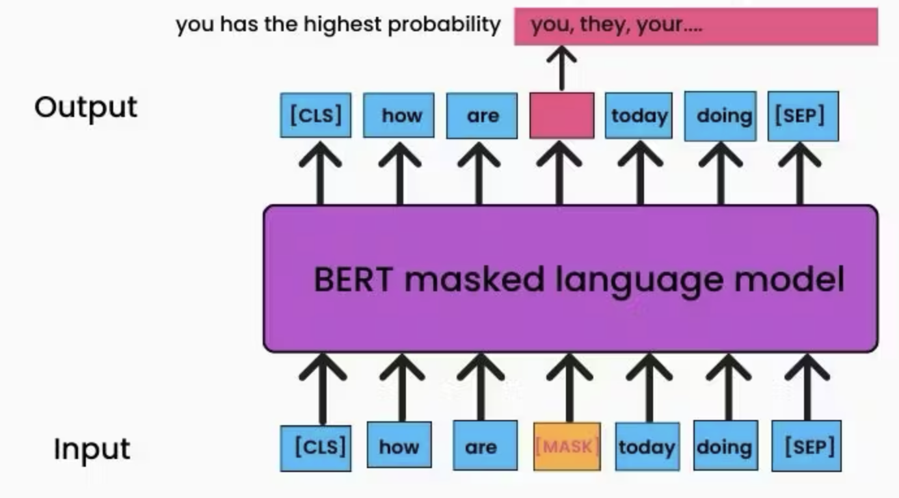

# word2vec and BERTs: The Significant Hybrids

The word2vec {cite}`mikolov2013distributed` and BERTs {cite}`devlin2018bert` are crucial steps towards LLMs. Compared to the previous language models, they are generally applicable to various language tasks.  

## Word Embeddings

Word embeddings are dense vector representations of words that capture semantic and syntactic relationships between words. Typically, the size of word embeddings is 64 - 1024.

## Data

For learning word representations like Word2Vec embeddings, large text corpora were used:

- Wikipedia: The full English Wikipedia (~2.5B words)

These corpora provided the training data for learning dense vector representations of words based on their contexts.

For pretraining Transformer models like BERT, even larger datasets were used:

- BooksCorpus: 800 million words from unpublished books
- English Wikipedia: 2.5 billion words
- Additional Web Data: Over 60 gigabytes of data from websites

## Models and Training Objectives

Both word2vec and BERT are trained to fill missing parts from the input texts. This means the training scheme is **self-supervised learning**, and we do not need human annotation - which means we can use a large-scale dataset.    

### word2vec

The word2Vec model is very simple. It's a shallow neural network trained by either one of the two objectives.

- **Continuous Bag-of-Words (CBOW)**: Predicts the current word based on surrounding contexts.
- **Skip-gram**: Predicts surrounding context words based on the current word.

### BERT

BERT is based on the Transformer architecture. It's train with two objectives.

- **Masked Language Modeling (MLM)**: Predicting randomly masked words based on context.
- **Next Sentence Prediction (NSP)**: Determining if two sentences were consecutive or not.

With MLM loss, BERT learns a pretty good word embedding. With NSP loss, BERT learns a nice sentence embedding.  

([image credit](https://www.turing.com/kb/how-bert-nlp-optimization-model-works))

In the image above, BERT has to predict what is the best word to be filled at the masked location. In my opinion, "they" wouldn't be wrong, though "you" is perhaps more likely. And this opinion came from my English experience. BERT also needs to learn good word embeddings to perform the given task.   

## Why important? Pre-training vs. Finetuning 

Only with word2vec and BERTs, many NLP tasks started to have two separate training stages; *pre-training* and *finetuning*.

**Pre-training**: Training a general model such as word2vec and BERT is called pre-training. This should be done in a large scale in terms of data, so that the model has good representations of many words in various contexts. To do that, one needs enough hardware.

**Finetuning**: One can use the trained word embedding model to solve downstream tasks. Compared to the pre-training stage, it's simple - so simple (or it may seem so) that we don't even call it "training" - we call it "tuning" (obviously, it's also training.)
