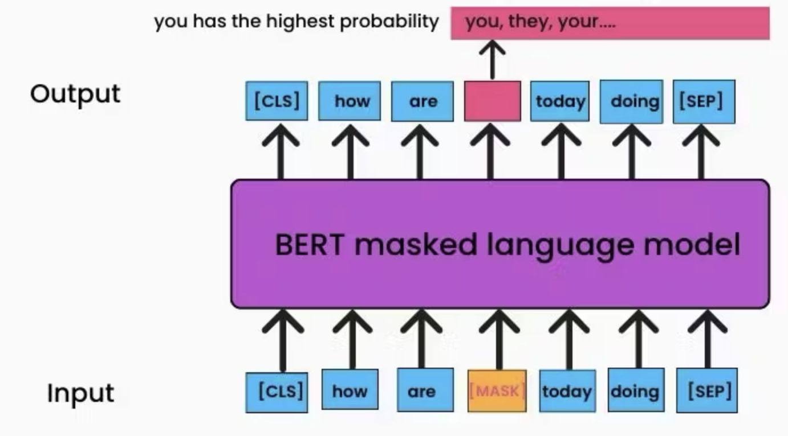

# Next-Token Prediction

## Training

Earlier in this book, we learned BERTs are trained with masked token prediction. 


([image credit](https://www.turing.com/kb/how-bert-nlp-optimization-model-works))

Training LLMs is quite different. Pretty much all the current LLMs are trained with "**next-token prediction**". This is related to why we call LLMs "*decoder-only transformers*", or "auto-regressive models". 

Let's say one of our training documents has this token sequence:

```
I / 'm / instant / iating / a / tokenizer / for / my / L/ LM / s
```

The next-token prediction is literally to predict the next token, based on the given sequence so far. For example,

```
"I / 'm / instant / iating / a" --> [LLM] --> "tokenizer"
```

In fact, it only shows a slice of the training. 
Usually, the prediction, loss calculation, and backpropagation are configured so that in a single batch at a step, once we have a sequence as a training item length of $N + 1$, we perform this to every token except the first one.
(This is also called "teacher forcing" autoregressive training.)

```
"I " --> [LLM] --> "'m"
"I / 'm" --> [LLM] --> "instant"
"I / 'm / instant" --> [LLM] -->  "iating"
"I / 'm / instant / iating" --> [LLM] -->  "a"
"I / 'm / instant / iating / a" --> [LLM] -->  "tokenizer"
"I / 'm / instant / iating / a / tokenizer" --> [LLM] -->  "for"
"I / 'm / instant / iating / a / tokenizer / for" --> [LLM] -->  "my"
"I / 'm / instant / iating / a / tokenizer / for / my" --> [LLM] -->  "L"
"I / 'm / instant / iating / a / tokenizer / for / my / L" --> [LLM] -->  "LM"
"I / 'm / instant / iating / a / tokenizer / for / my / L/ LM" --> [LLM] -->  "s"
```


## Inference

Once we train a LLM, we can provide an input sequence to get the next token. Then, we can append it to get the next next token. Then, we can append it again to get the next next next tokens. And so on, and so forth.. 


([image credit](https://jalammar.github.io/illustrated-gpt2/))


## LLMs are so fluent!..ly perform text completion

Now you get why LLMs are so fluent and can keep talking, on and on. That's exactly what LLMs are trained for. 


### In-context Learning; Prompt-engineering

> "Even if trained only with the next-token prediction objective, LLMs can perform in-context learning."

That's true, but I would rather say this:

> LLMs perform in-context learning precisely because LLMs are trained with the next-token prediction objective. 

LLMs learn to continue text content. When performing the prompt engineering, we're steering a LLM by selecting the first tokens so that the LLM would generate the next tokens as we want.       

