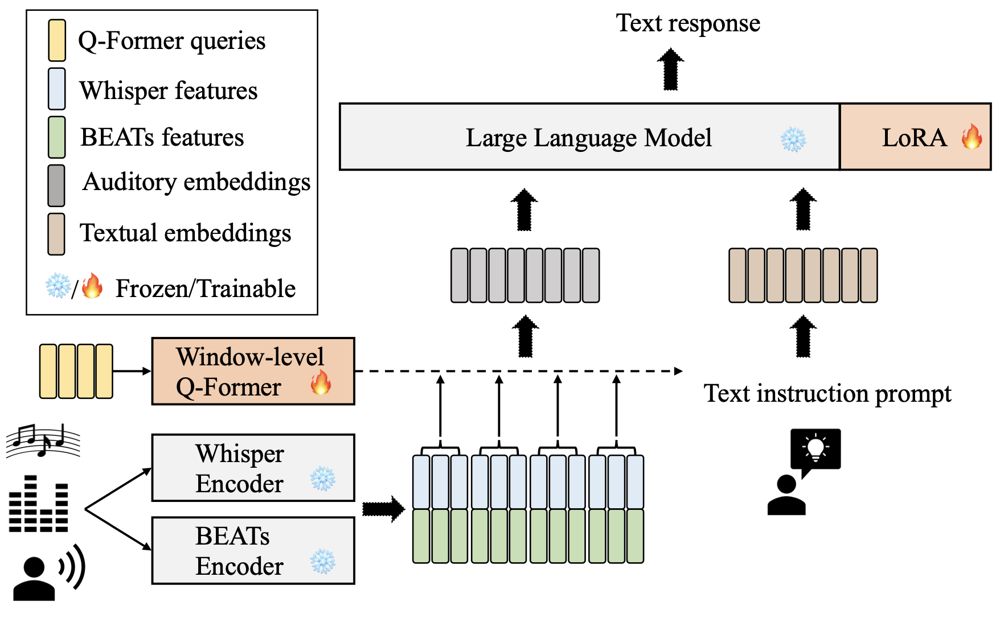
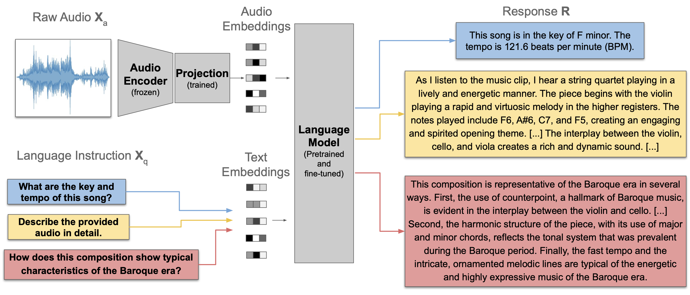

# Music Audio LLMs

So, how can we feed audio signals to a LLM? It's really the same as we did with images. We need to somewhat find a way to represent the audio signal in a vector sequence, $\mathbf{H}_\mathtt{a}$ and perhaps feed it with some text representation $\mathbf{H}_\mathtt{q}$.   

## Salmonn

On a high level, Salmonn {cite}`tang2023salmonn` architecture seems just like LLaVa.  

The authors of Salmonn used two complementary audio models -- Whisper (a model for speech recognition, {cite}`radford2023robust`) and BEATs (general audio encoder, {cite}`chen2022beats`). With these two audio models, Salmonn can perform speech, audio, and music tasks. 

Q-Former {cite}`li2023blip` is essentially equivalent to the image adaptor, with a bit more sophisticated computation on another transformer structure. By adopting Q-Former, we get not only matched the vector embedding size but also a fixed temporal length.

(Note: LoRA {cite}`hu2021lora` is one of the efficient finetuning methods.)

## LLark

Unfortunately, you have to turn your head 90 degree clockwise to see the LLark architecture {cite}`gardner2023llark`.

The "Audio Encoder (frozen)" is a Jukebox encoder {cite}`castellon2021codified` that converts a raw audio $\mathbf{X}_\texttt{a}$ to a sequence of 4800-dim vectors. After temporal downsampling, this sequence is again converted by a linear layer.   
